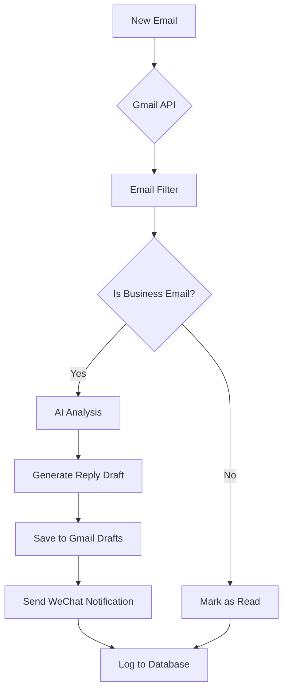

# 📧 AI Email Management Agent

[](https://www.python.org/)
[](LICENSE)
[](https://platform.deepseek.com/)
[](https://developers.google.com/gmail)

An intelligent email management system that automatically processes Gmail inbox, filters emails, analyzes content with AI, generates reply drafts, and notifies teams via WeChat for manual review.

## ✨ Features

- **📬 Smart Email Monitoring**: Real-time Gmail inbox monitoring
- **🔍 Intelligent Filtering**: Filters out spam, newsletters, and non-business emails
- **🤖 AI-Powered Analysis**: Uses DeepSeek AI to analyze email content and categorize business inquiries
- **✍️ Auto-Draft Generation**: Generates professional reply drafts for business emails
- **📱 Team Notifications**: Sends real-time WeChat notifications for team review
- **💾 Database Tracking**: Logs all processed emails and drafts for audit trail
- **⚙️ Configurable Rules**: Customizable filtering rules and AI prompts

## 🏗️ Architecture

```
email_agent/
├── src/
│   ├── core/           # Core processing modules
│   │   ├── gmail_client.py     # Gmail API client
│   │   ├── mail_filter.py      # Email filtering logic
│   │   ├── ai_analyzer.py      # AI content analysis
│   │   └── draft_generator.py  # Draft generation
│   ├── notification/   # Notification modules
│   │   └── wechat_notifier.py  # WeChat notifications
│   ├── config/         # Configuration management
│   │   └── settings.py
│   └── database/       # Data storage
│       └── models.py
├── main.py             # Main application entry
├── requirements.txt    # Python dependencies
└── README.md          # This file
```

## 🚀 Quick Start

### Prerequisites
- Python 3.8+
- Gmail account with API access
- DeepSeek API key
- WeChat Enterprise account (optional, for notifications)

### Installation

1. **Clone the repository**
```bash
git clone https://github.com/yourusername/email-agent.git
cd email-agent
```

2. **Create virtual environment (recommended)**
```bash
python -m venv venv
source venv/bin/activate  # On Windows: venv\Scripts\activate
```

3. **Install dependencies**
```bash
pip install -r requirements.txt
```

4. **Configure environment variables**
```bash
cp .env.example .env
# Edit .env with your API keys and settings
```

5. **Set up Gmail API**
   - Create a project in [Google Cloud Console](https://console.cloud.google.com/)
   - Enable Gmail API
   - Create OAuth 2.0 credentials (Desktop app type)
   - Download `credentials.json` to project root
   - Add your email as a test user in OAuth consent screen

### Configuration

Edit `.env` file with your settings:

```env
# DeepSeek API Configuration
DEEPSEEK_API_KEY=your_deepseek_api_key
DEEPSEEK_API_BASE=https://api.deepseek.com/v1

# Gmail API Configuration
GMAIL_CREDENTIALS_PATH=./credentials.json
GMAIL_TOKEN_PATH=./token.json

# WeChat Notification (optional)
WECHAT_WEBHOOK_URL=your_wechat_webhook_url

# Application Settings
APP_NAME=EmailAgent
LOG_LEVEL=INFO
CHECK_INTERVAL_SECONDS=60
MAX_EMAILS_PER_CHECK=10

# Email Filter Settings
BLACKLISTED_DOMAINS=no-reply,newsletter,marketing,notification
BLACKLISTED_SUBJECTS=unsubscribe,newsletter,promotion,advertisement
MIN_CONTENT_LENGTH=50
```

## 📖 Usage

### Single Run Mode
Process current unread emails once:
```bash
python main.py --mode once
```

### Continuous Monitoring Mode
Monitor inbox continuously (every 60 seconds by default):
```bash
python main.py --mode continuous
```

With custom interval (every 30 seconds):
```bash
python main.py --mode continuous --interval 30
```

### Using Start Script
```bash
chmod +x start.sh
./start.sh
```

## 🔧 How It Works

### 1. Email Monitoring
- Connects to Gmail API using OAuth 2.0
- Monitors inbox for new unread emails
- Retrieves email content and metadata

### 2. Smart Filtering
- Filters out emails from blacklisted domains
- Detects and removes newsletters, promotions, spam
- Identifies no-reply and automated emails
- Only passes through potential business inquiries

### 3. AI Analysis
- Uses DeepSeek AI to analyze email content
- Determines if email is a business inquiry
- Categorizes email type (product inquiry, support request, etc.)
- Assesses urgency level
- Provides confidence score

### 4. Draft Generation
- Generates professional, personalized reply drafts
- Maintains appropriate tone and formality
- Includes relevant information and next steps
- Saves drafts to Gmail drafts folder

### 5. Team Notification
- Sends WeChat notifications for review
- Includes email details and AI analysis
- Provides direct link to Gmail draft
- Supports batch notifications for multiple emails

### 6. Database Logging
- Tracks all processed emails
- Stores AI analysis results
- Logs generated drafts
- Maintains audit trail

## 🛠️ Technical Details

### Dependencies
- `google-api-python-client`: Gmail API integration
- `deepseek-api`: AI-powered email analysis and draft generation
- `sqlalchemy`: Database ORM
- `loguru`: Structured logging
- `schedule`: Task scheduling
- `pydantic`: Configuration validation

### Database Schema
- **Emails**: Stores processed email metadata and status
- **Drafts**: Tracks generated reply drafts
- **ProcessingLogs**: Audit trail of all processing actions

### Security Features
- OAuth 2.0 authentication for Gmail API
- Environment variable management for sensitive data
- Minimal required permissions (read-only + draft creation)
- Local SQLite database with no external dependencies

## 📊 Performance

- **Token Efficiency**: Optimized to work within 131,072 token limit
- **Processing Speed**: Processes 10+ emails per minute
- **API Usage**: Efficient token usage with caching strategies
- **Memory Footprint**: Lightweight with minimal resource consumption

## 🔄 Workflow



## 🤝 Contributing

Contributions are welcome! Please feel free to submit a Pull Request.

1. Fork the repository
2. Create your feature branch (`git checkout -b feature/AmazingFeature`)
3. Commit your changes (`git commit -m 'Add some AmazingFeature'`)
4. Push to the branch (`git push origin feature/AmazingFeature`)
5. Open a Pull Request

## 📄 License

This project is licensed under the MIT License - see the [LICENSE](LICENSE) file for details.

## 🙏 Acknowledgments

- [Google Gmail API](https://developers.google.com/gmail) for email access
- [DeepSeek](https://platform.deepseek.com/) for AI capabilities
- [WeChat Work API](https://work.weixin.qq.com/) for notifications
- All open-source libraries used in this project

## 📞 Support

For support, please:
1. Check the [SETUP_GUIDE.md](SETUP_GUIDE.md) for detailed setup instructions
2. Review the [PROJECT_SUMMARY.md](PROJECT_SUMMARY.md) for technical details
3. Open an issue on GitHub for bugs or feature requests

---

**⭐ If you find this project useful, please give it a star on GitHub!**